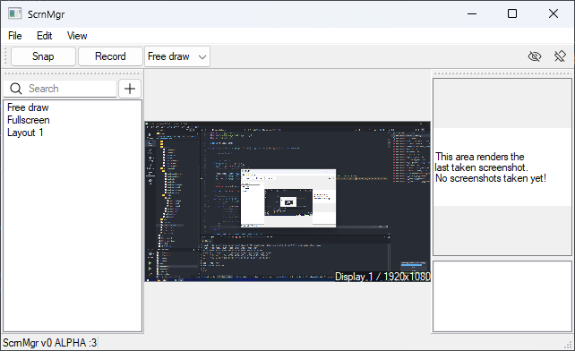

> [!IMPORTANT]
> This project is not finished yet and is available at a very early stage of testing.
>
> I only work on this project when i have time and feel like it. 

# ScrnshotMgr (Screenshot Manager)
ScrnshotMgr is an open-source gui app made in Qt6 for taking screenshots with ease.

Additionally features minimal video recording (WIP) for taking clips

This project was made because i wanted to replace windows snipping tool and not use sharex lol

## Features:

- Screenshot capture list
- Preset/Region capture
- Preview region of capture

## Building/Contributing

1. Download Qt Creator <https://www.qt.io/download>
2. `git clone https://github.com/Panniku/ScrnMgr/`
3. Open directory in Qt Creator and simply run for now (i havent figured out cmake building)
